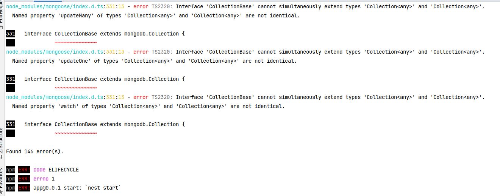

# Описание
* на бэке используем Nest.js и БД MongoDB. Оба упаковываем в Docker-контейнеры (см. docker-compose-back.yml и docker-compose-mongo.yml)
* на фронте используем Nuxt.js (Vue)

# Запуск локальный
* клонируем
  * clone `git clone ...`
  
* скачиваем зависимости
  * cd packages/api && yarn install
  * cd packages/client && yarn install
  * альтернатива - `make dep_inst`

* запускаем фронт
    * `cd packages/client && yarn dev`
    * альтернатива - `make front_start`
    * переходим в браузере по адресу `localhost:22082`
  
* запускаем MongoDB
  * из корня проекта выполняем `docker-compose -f docker-compose-mongo.yml up`
  * альтернатива - `make mongo_start`
  * БД будет располагаться на эндпоинте `localhost:22081`
  * mongodb без логина/пароля, имя БД - `test`
  
* запускаем бэк:
    * в контейнере
      * из корня проекта выполнить `docker-compose -f docker-compose-back.yml up`; 
      * альтернатива - `make back_start`
    * или локально
      * `cd packages/api && yarn run start:dev`
      * альтернатива - `make back_start_local`
    * работает на эндпоинте `localhost:22083`
    * "GraphQL Playground" будет доступен в браузере по адресу `localhost:22083/graphql`

# История
* 2021-07-01 почему то бэкенд перестал запускаться через npm, а через yarn запускается

* 2021-07-01 поменяны порты, добавлен Makefile
* 2021-07-02 rev-0.1.0
